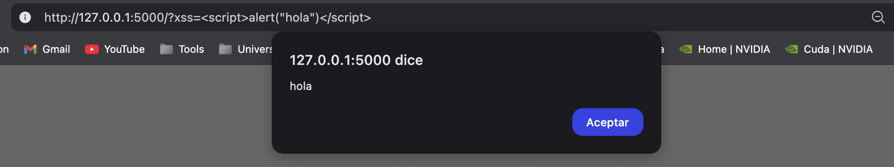

# Ejercicio 1: Reflected XSS

Añadimos un campo en la página web con jinja que introduce en el html el valor de un parámetro de la URL, sin sanitizar la entrada

Código original:
```html
<div class="row mt-5 mb-5">
    <div class="col">
        <p class="svaia-text mb-0" style="font-size: 8rem;">SVAIA</p>
        <p class="text-dark fs-4"><i>Sistema de soporte para Vulnerabilidades y Amenazas basado en Inteligencia Artificial</i></p>
    </div>
</div>
```

Código inseguro:
```html
<div class="row mt-5 mb-5">
    <div class="col">
        <p class="svaia-text mb-0" style="font-size: 8rem;">SVAIA</p>
        <p class="text-dark fs-4"><i>Sistema de soporte para Vulnerabilidades y Amenazas basado en Inteligencia Artificial</i></p>
        
            <p>{{ request.args.get('xss') | safe }}</p>
        
    </div>
</div>
```

Como se ve sin argumentos en la URL:


Inyectando código html en el argumento:


Inyectando código javascript en el argumento de la URL para mostrar una alerta:


# Ejercicio 2: Stored XSS

Hacemos que al cargar un proyecto en la página de admin, en vez de introducir la descripción en un campo de texto, sustituimos el innerHTML del elemento

Version segura:
```js
projectItem.querySelector('.project-description').textContent = `Descripción: ${project.description}`;
```

Versión insegura:
```js
projectItem.querySelector('.project-description').innerHTML = `Descripción: ${project.description}`;
```

Cómo se ve de normal:


Un usuario del sistema introduce el siguiente payload en la descripción.

```html

```

Cuando se carga el proyecto desde la página de admin, se ejecuta el código javascript, intentando cargar una imagen desde la URL, que no existe, por lo que se ejecuta el código javascript y se muestra una alerta:


# Ejercicio 3: DOM-based XSS

Añadimos el siguiente código en el archivo projects.js. Esto lo que hace es cambiar el nombre del proyecto en función del parámetro que se le pasa como argumento en la URL.

Código original:
```js
projectItem.querySelector('.project-name').textContent = `Nombre: ${project.name}`;
```

Código inseguro:
```js
const urlParams = new URLSearchParams(window.location.search);
const name = urlParams.get('name');
if (name) {
    projectItem.querySelector('.project-name').innerHTML = `Nombre: ${name}`;
}
else {
    projectItem.querySelector('.project-name').textContent = `Nombre: ${project.name}`;
}
```

Cómo se ve de normal:


Inyectando un payload de JavaScript en el argumento de la URL:

```js

``` 


